# veto — Architecture

> Diagrams first. Code second. Words only when neither suffices.

---

## 1. System Overview

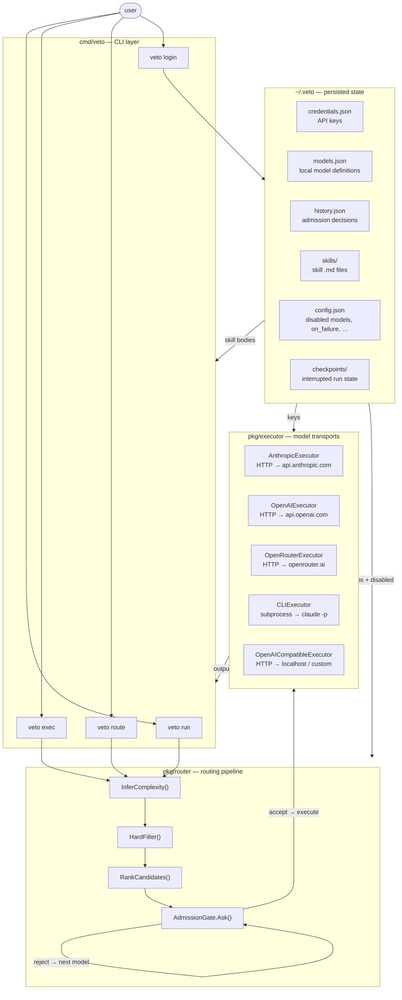

---

## 2. Routing Pipeline

Every command routes through the same four stages. Stages 1–3 are pure functions (no I/O). Stage 4 makes real model calls.

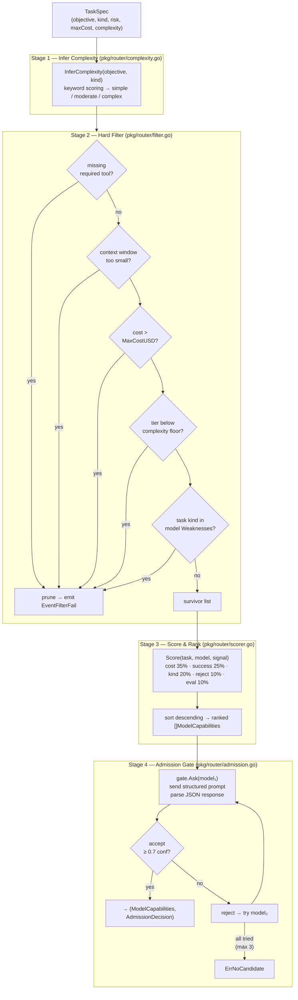

---

## 3. Complexity Inference

The manager auto-infers complexity before any filtering. No user input required.

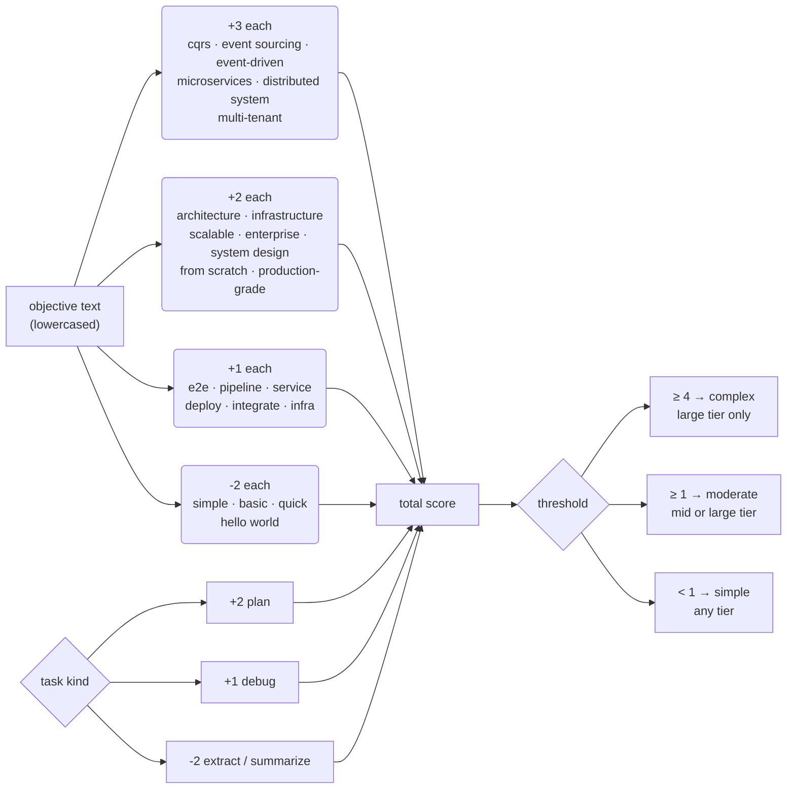

**Code:**
```go
// pkg/router/complexity.go
func InferComplexity(objective string, kind TaskKind) Complexity {
    s := strings.ToLower(objective)
    score := 0
    for _, kw := range highComplexKeywords { if strings.Contains(s, kw) { score += 3 } }
    for _, kw := range medComplexKeywords  { if strings.Contains(s, kw) { score += 2 } }
    for _, kw := range lowComplexKeywords  { if strings.Contains(s, kw) { score++ } }
    for _, kw := range simpleKeywords      { if strings.Contains(s, kw) { score -= 2 } }
    switch kind {
    case KindPlan:               score += 2
    case KindDebug:              score++
    case KindExtract, KindSummarize: score -= 2
    }
    switch { case score >= 4: return ComplexityComplex
             case score >= 1: return ComplexityModerate
             default:         return ComplexitySimple }
}
```

**Tier enforcement in hard filter:**
```go
// pkg/router/filter.go
func tierMeetsComplexity(tier string, complexity Complexity) bool {
    switch complexity {
    case ComplexityComplex:  return tier == "large"
    case ComplexityModerate: return tier == "mid" || tier == "large"
    default:                 return true
    }
}
```

**Examples:**

| Objective | Kind | Score | Complexity | Eligible tiers |
|-----------|------|-------|------------|----------------|
| `"build e2e CQRS infrastructure with event sourcing"` | code-change | +1+3+2+1=7 | complex | large only |
| `"implement authentication service"` | code-change | +1+1=2 | moderate | mid, large |
| `"create simple html page"` | code-change | -2=−2 | simple | all |
| `"design microservices architecture"` | plan | +3+2+2=7 | complex | large only |

---

## 4. Scoring Formula

Models that survive the hard filter are ranked by a weighted score. Cheapest viable model wins by default.

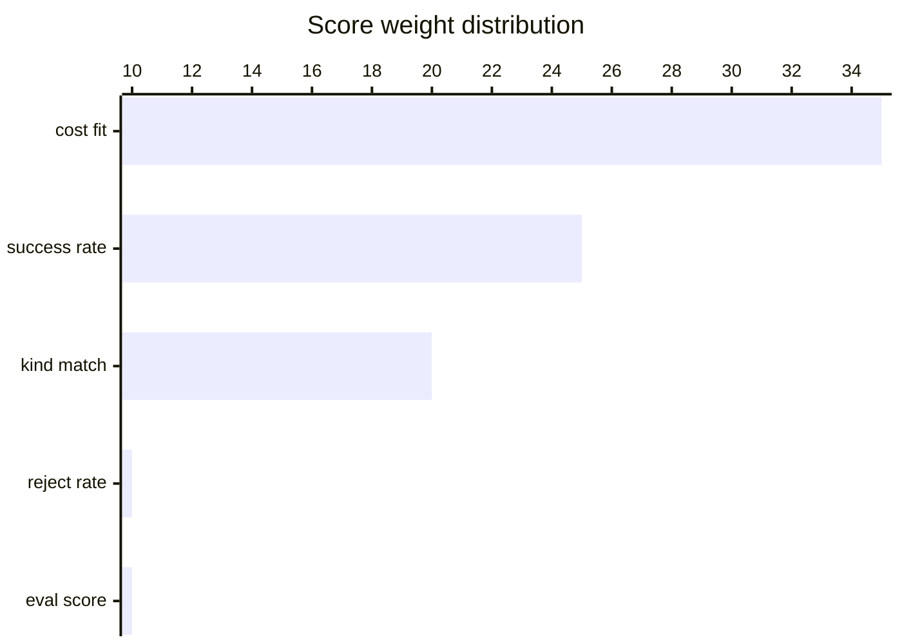

```go
// pkg/router/scorer.go
func Score(task TaskSpec, model ModelCapabilities, signal RoutingSignal) float64 {
    return kindMatch(model, task.Kind) * 0.20 +
        signal.HistoricalSuccessRate   * 0.25 +
        costFit(model, task)           * 0.35 +
        (1.0 - signal.HistoricalRejectRate) * 0.10 +
        signal.AvgEvalScore            * 0.10
}
```

**`costFit` — the key function:**
```go
func costFit(m ModelCapabilities, task TaskSpec) float64 {
    if task.MaxCostUSD > 0 {
        est := estimatedCost(m, task)
        if est >= task.MaxCostUSD { return 0.0 }
        return 1.0 - (est / task.MaxCostUSD)
    }
    const ref = 0.015 // opus input cost as reference baseline
    if m.CostPer1kInputUSD <= 0 { return 1.0 } // local / free
    return max(0.05, 1.0-(m.CostPer1kInputUSD/ref))
}
```

**Resulting costFit scores (no ceiling set):**

| Model | $/1k input | costFit |
|-------|-----------|---------|
| local ollama | $0.000 | **1.000** |
| haiku | $0.00025 | 0.983 |
| gpt-4.1-mini | $0.0004 | 0.973 |
| gpt-4.1 | $0.002 | 0.867 |
| sonnet | $0.003 | 0.800 |
| opus | $0.015 | **0.050** |

---

## 5. Admission Gate — Self-Admitting Receivers

Each candidate model receives a structured prompt and must respond with JSON only. The gate never silently accepts on ambiguity.

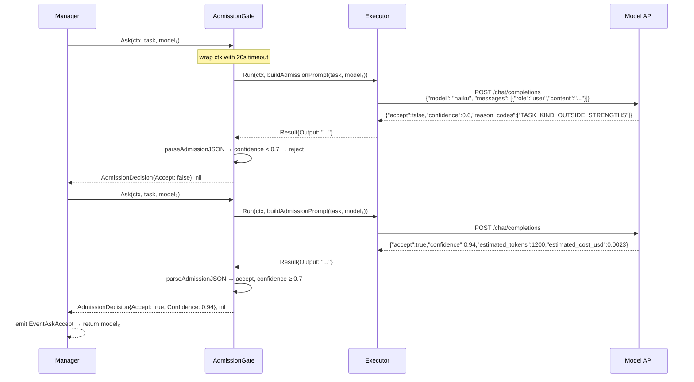

**Admission prompt structure:**
```
You are the haiku model (small tier). A task router has selected you as a candidate.

TASK:
  kind: code-change
  objective: create a simple HTML page with history of Amsterdam
  constraints: none
  required tools: none
  risk: medium

YOUR PROFILE:
  max context tokens: 200000
  supported tools: bash, read, write, edit

Respond with ONLY valid JSON:
{
  "accept": <bool>,
  "confidence": <float 0.0-1.0>,
  "reason_codes": [...],
  "estimated_tokens": <int>,
  "estimated_cost_usd": <float>,
  "suggested_alternative_model": <string>,
  "required_task_changes": [...]
}
```

**Two failure paths:**

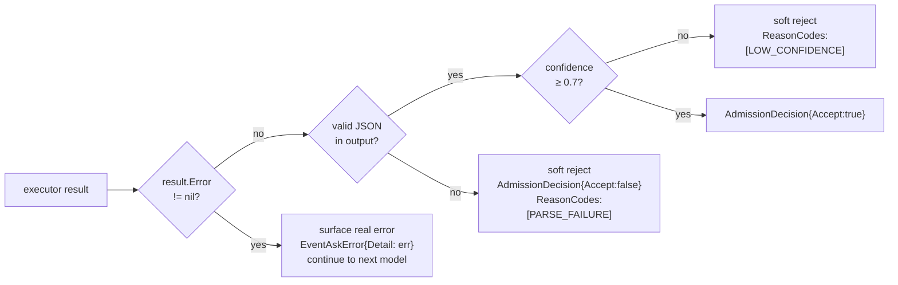

---

## 6. Executors

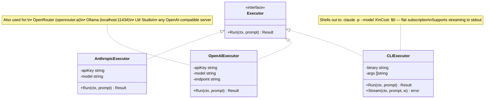

**Executor selection in `buildProviderRegistry`:**

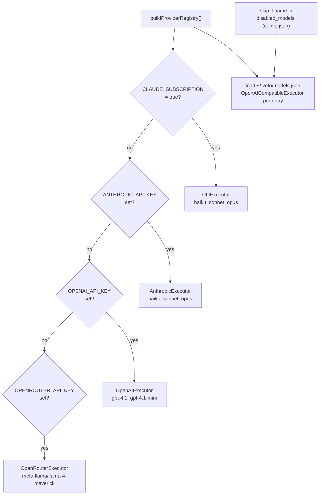

**Ollama auto-start (no manual `ollama serve` needed):**

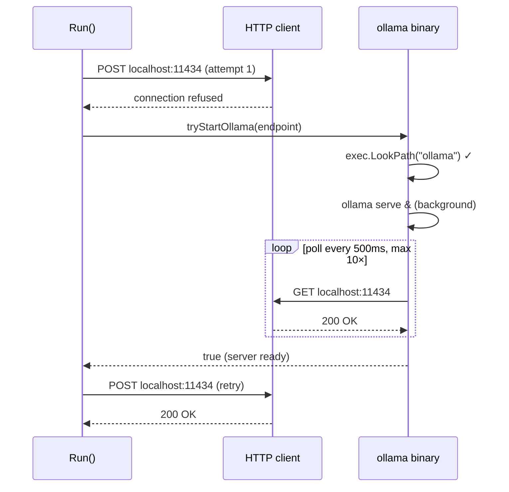

---

## 7. Plan Execution — `veto exec`

Each step routes independently. A planning step goes to a large-tier model; a summarise step goes to haiku.

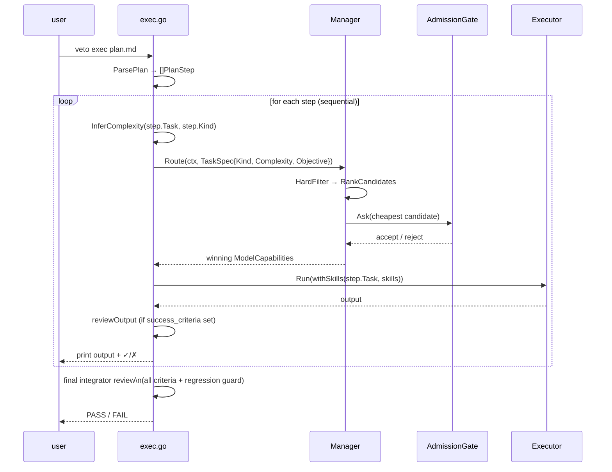

**Plan file format:**
```markdown
---
title: Refactor auth middleware
version: 1
steps:
  - task: "List what each function in auth/middleware.go does"
    kind: extract
    risk: low
  - task: "Rewrite token validation using stdlib crypto/hmac"
    kind: code-change
    risk: medium
    depends_on: [1]
    success_criteria: "no third-party JWT dep; existing tests pass"
  - task: "Design the new session storage architecture"
    kind: plan
    risk: high
---
```

**Per-step complexity and tier routing:**

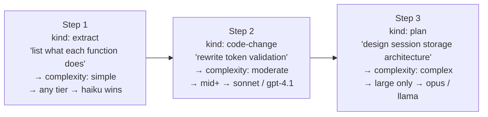

---

## 8. Skills Injection

Skills are markdown files with YAML frontmatter. They are prepended to the executor prompt — not the admission prompt. Routing always uses the clean objective.

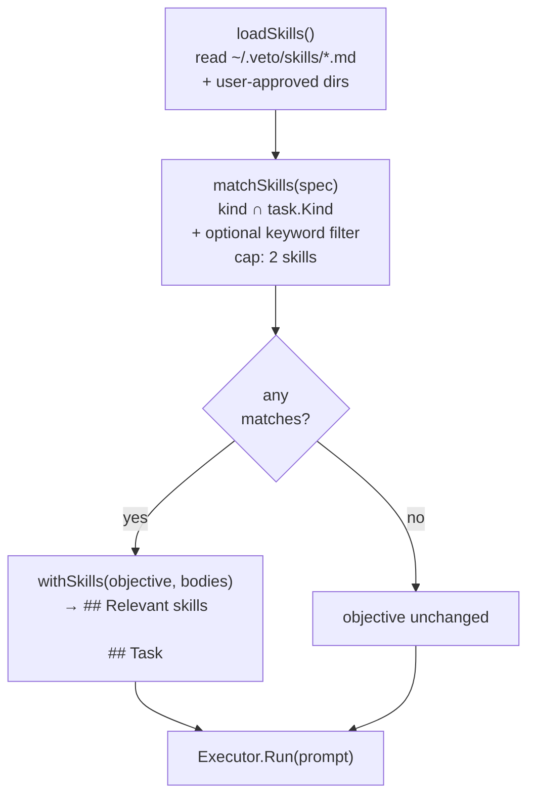

**Skill file format:**
```markdown
---
name: code-change
kinds: [code-change, refactor]
keywords: []
---
- Prefer the minimal diff — change only what the task requires.
- Preserve existing naming conventions and indentation.
- Write one test per changed behaviour.
```

**Injected prompt structure:**
```
## Relevant skills

- Prefer the minimal diff — change only what the task requires.
- Preserve existing naming conventions and indentation.
- Write one test per changed behaviour.

## Task

rewrite the token validation function to use stdlib crypto/hmac
```

---

## 9. Acceptance-Criteria Review

Runs after execution when `--criteria` is set (on `veto run`) or `success_criteria` is set on a plan step.

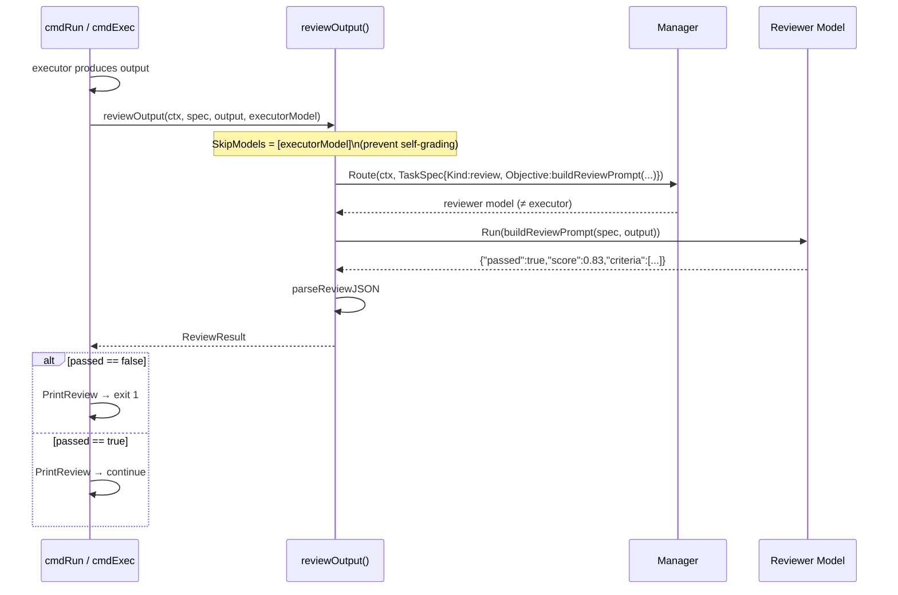

**Reviewer response:**
```json
{
  "passed": false,
  "score": 0.50,
  "criteria": [
    {
      "criterion": "no third-party JWT dep",
      "met": true,
      "note": "only stdlib crypto/hmac used"
    },
    {
      "criterion": "existing tests pass",
      "met": false,
      "note": "TestRefresh fails — HMAC signature mismatch after migration"
    }
  ]
}
```

---

## 10. Event Bus

The manager emits events. The CLI wires `OnEvent` to a renderer and a logger — neither is coupled to the other.

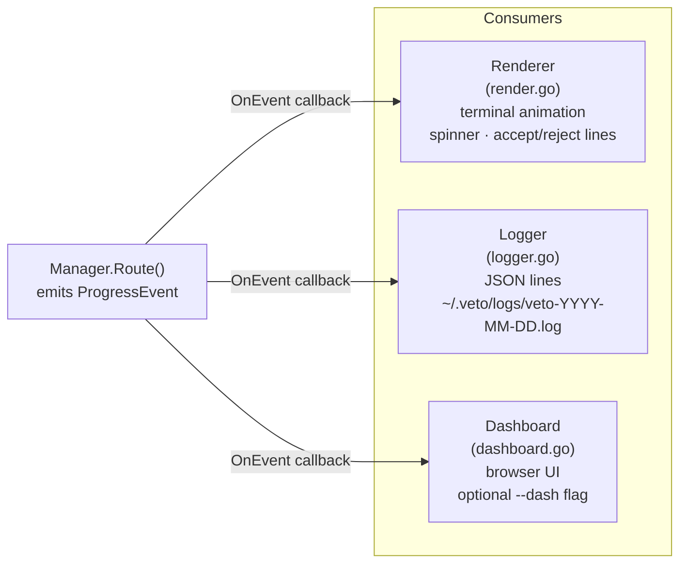

| Event | Carries |
|-------|---------|
| `filter_pass` | model name |
| `filter_fail` | model name, reason code |
| `ask_start` | model name |
| `ask_accept` | model, confidence, est. tokens, est. cost |
| `ask_reject` | model, reason codes |
| `ask_error` | model, `Detail` = real error string |

---

## 11. State Files

```
~/.veto/
├── credentials.json     # { "ANTHROPIC_API_KEY": "sk-ant-...", ... }   mode 0600
├── models.json          # [{ "name": "qwen2.5", "endpoint": "...", ... }]
├── config.json          # { "disabled_models": [...], "on_failure": "abort", "skills": {...} }
├── history.json         # admission decisions (accept/reject per task+model)
├── skills/
│   ├── code-change.md   # auto-generated or hand-written skill files
│   └── review.md
├── plans/
│   └── 20260701-refactor-auth-converted.md
├── checkpoints/
│   └── a3f1b2c4d5e6f7a8.json   # interrupted run state (SHA-256 of task identity)
└── logs/
    └── veto-2026-07-02.log     # JSON lines, pruned after 7 days
```

**Task identity hash** (used for checkpoints and deduplication):
```go
func taskHash(objective, kind, risk string, maxCost float64) string {
    h := sha256.New()
    fmt.Fprintf(h, "%s|%s|%s|%.6f", objective, kind, risk, maxCost)
    return hex.EncodeToString(h.Sum(nil))[:16]
}
```

---

## 12. Package Layout

```mermaid
graph LR
    subgraph CMD["cmd/veto"]
        MAIN["main.go\nentry · provider registry\ndisable/enable"]
        RUN_F["run.go\ncmdRun · routeAndCapture"]
        EXEC_F["exec.go\ncmdExec · plan steps"]
        PLAN_F["plan.go\nParsePlan · ValidatePlan · convertPlan"]
        SKILLS_F["skills.go\nloadSkills · matchSkills · withSkills"]
        REVIEW_F["review.go\nbuildReviewPrompt · reviewOutput"]
        RENDER_F["render.go\nRenderer · PrintTaskHeader · OnEvent"]
        LOGIN_F["login.go\nveto login · Ollama wizard"]
        CKP_F["checkpoint.go\nCheckpoint · save/load"]
    end

    subgraph PKG_ROUTER["pkg/router"]
        TYPES["types.go\nTaskSpec · ModelCapabilities\nComplexity · Risk · TaskKind"]
        COMP["complexity.go\nInferComplexity · tierMeetsComplexity"]
        FILTER["filter.go\nHardFilter · estimatedCost"]
        SCORER["scorer.go\nScore · RankCandidates · costFit"]
        ADMISSION["admission.go\nAdmissionGate · buildAdmissionPrompt\nparseAdmissionJSON"]
        MANAGER["manager.go\nManager.Route · emit"]
        REGISTRY["registry.go\ncatalog · NewRegistry · NewRegistryFromModels"]
        EVENTS["events.go\nProgressEvent · EventKind"]
        STORE["store.go\nFileStore · MemoryStore · LogDecision"]
    end

    subgraph PKG_EXEC["pkg/executor"]
        ANT_E["anthropic.go\nAnthropicExecutor"]
        OAI_E["openai.go\nOpenAIExecutor · tryStartOllama"]
        CLI_E_F["cli.go\nCLIExecutor · Stream"]
        RETRY["retry.go\nretryableStatus · retryAfter"]
        RES["result.go\nResult{Output, Error}"]
    end

    CMD --> PKG_ROUTER
    CMD --> PKG_EXEC
    PKG_ROUTER -->|ExecutorFactory interface| PKG_EXEC
```
