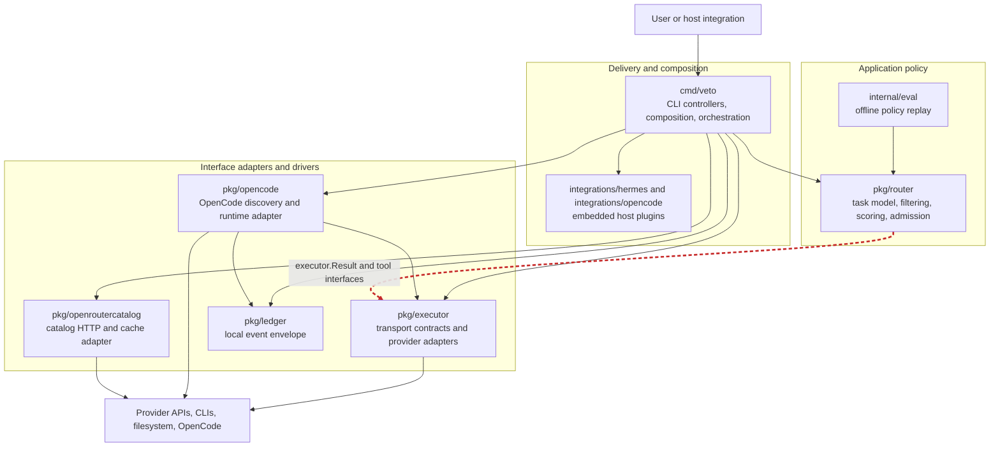
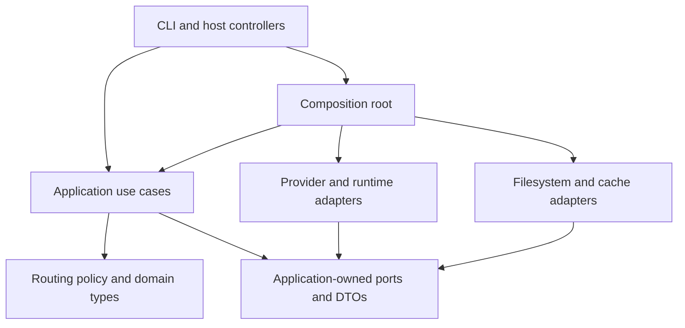

# Clean architecture evaluation

This evaluation applies the dependency rule, boundary design, component
principles, and SOLID to Veto's current Go package structure. It was performed
against `main` at `bf3f40c`.

## Verdict: 7/10

Veto has a good architectural core: routing policy is mostly isolated,
provider implementations are replaceable, the package graph is acyclic, and
the executable is assembled at the edge. It is not fully clean because one
source dependency points from routing policy to transport details, persistence
is co-located with routing policy, and the CLI package owns application
orchestration that should be independent of terminal delivery.

This is a modular monolith with partial ports-and-adapters boundaries. That is
an appropriate shape for a single-binary CLI. Reaching 10/10 does not require
microservices, a framework, or a repository-wide rewrite.

## Current dependency diagram

Solid arrows are source-code dependencies. The dashed red arrow is the main
dependency-rule violation: routing policy imports result and tool-capability
types from the transport package.

The runtime flow remains sound despite that source dependency: the CLI builds
the registry and concrete executors, `router.Manager` filters and ranks models,
`AdmissionGate` asks candidates through an interface, and the CLI invokes the
selected executor's separate full-task contract.

## Scorecard

| Principle | Score | Evidence |
|---|---:|---|
| Dependency rule | 6/10 | `cmd/veto` points inward and concrete providers do not enter routing policy, but `pkg/router/admission.go` imports `pkg/executor`. `pkg/router/store.go` also contains both the `Store` port and filesystem persistence. |
| Entities and use cases | 7/10 | `TaskSpec`, `ModelCapabilities`, filtering, scoring, preferences, and complexity inference are plain Go policy. Route-and-execute, acceptance review, output handling, and some task classification remain application rules inside `cmd/veto`. |
| Adapters and frameworks | 8/10 | Provider HTTP/CLI implementations, OpenCode, catalog discovery, and host integrations are separated packages. Veto has very few third-party dependencies and no framework dictates its structure. Transport contracts and implementations are still combined in `pkg/executor`. |
| Component principles | 7/10 | The internal package graph has no cycles and most packages have a clear change reason. `cmd/veto` is an 8,000+ line change hotspot spanning delivery, application orchestration, configuration, persistence, updates, and diagnostics. |
| SOLID | 7/10 | Consumer-side interfaces such as `ExecutorFactory`, `Store`, `ModelSource`, `httpDoer`, `Process`, and `doctorFilesystem` support substitution and tests. The large CLI package and mixed executor contract/implementation package weaken SRP and DIP. |
| Boundary anatomy | 7/10 | `main` acts as a composition root, DTOs cross boundaries, and fakes can replace external systems. The admission boundary leaks an outer `executor.Result`, while application output and review flows depend directly on CLI-level types and side effects. |

## What is working well

1. **Routing policy is explicit and testable.** Hard filtering, scoring,
   preferences, complexity inference, and candidate selection live in
   `pkg/router` and operate on plain structs.
2. **Admission and execution are separate contracts.** The short admission
   probe cannot accidentally inherit the full execution budget or authority.
3. **Concrete providers are composed at the edge.** `providerRegistry` in
   `cmd/veto/main.go` selects adapters; the router does not import Anthropic,
   OpenAI, OpenRouter, Codex, or OpenCode implementations.
4. **External volatility is usually behind narrow seams.** HTTP, process,
   filesystem, model-source, store, and executor behavior can be replaced in
   tests.
5. **Framework independence is strong.** The production module is primarily
   standard-library Go, so business policy is not organized around an HTTP,
   CLI, ORM, or dependency-injection framework.
6. **The component graph is acyclic.** The current internal imports form a
   directed graph rooted at `cmd/veto`; no lower-level package imports the CLI
   or embedded integrations.

## Main gaps

### 1. Routing policy depends on a transport package

`pkg/router/admission.go` defines the consumer-side `Executor` interface, but
its method returns `executor.Result` and the admission gate asserts
`executor.ToolProvider` and `executor.ToolCapabilityStatus`. The interface is
in the right place; its data and capability contracts are not.

This is the clearest dependency-rule violation. A transport-level result or
tool contract can change for full execution reasons and force a change or
retest of the routing core.

### 2. Persistence implementation sits beside routing policy

`pkg/router/store.go` correctly defines the `Store` and `KindAwareStore` ports,
but also implements `FileStore` using `os` and `filepath`. Package boundaries
therefore cannot prevent routing policy from growing filesystem knowledge.

The in-memory implementation is useful as a policy-side test double. The file
implementation is an adapter and should be outside the core package.

### 3. The CLI package is both controller and application layer

`cmd/veto` parses flags and renders terminal output, but it also prepares the
routing graph, performs route-and-execute orchestration, validates execution
results, records metrics, runs acceptance reviews, classifies objectives, and
owns output-file policy. These rules are testable today because they are plain
functions, but they cannot be reused without importing a `main` package and
CLI-oriented dependencies.

The symptom is component size rather than a single bad function:
`cmd/veto` contains more than 8,000 production lines and changes for many
independent actors, including routing, provider onboarding, diagnostics,
updates, analytics, integrations, and terminal UX.

### 4. Transport contracts and implementations share one package

`pkg/executor/result.go` defines stable execution contracts, while sibling
files implement several volatile provider transports. This is a practical
partial boundary, but it makes every consumer depend on the package that also
owns provider details. `pkg/opencode` consequently imports `pkg/executor` to
implement the shared runtime result contract.

## Path to 10/10

Do these in order and keep each step behavior-preserving.

1. **Invert the admission boundary.** Define a narrow admission port and its
   response/tool-capability DTOs in `pkg/router`. Adapt provider execution
   results at the composition edge. Add an import-boundary test that rejects
   dependencies from `pkg/router` to `pkg/executor`, `cmd`, or `integrations`.
2. **Move `FileStore` to an adapter package.** Keep `Store`, `KindAwareStore`,
   and `MemoryStore` with routing policy; put JSON/filesystem persistence in a
   package such as `internal/adapter/routinghistory`. Inject it from the
   composition root.
3. **Extract application use cases from `cmd/veto`.** Start with one vertical
   slice: route-and-execute plus acceptance review. Give it plain request and
   response structs and ports for event output, execution, history, clock, and
   artifact writing. Leave flag parsing, terminal rendering, and `os.Exit` in
   thin CLI controllers.
4. **Separate stable execution contracts from provider adapters.** Move result,
   usage, event, tool-capability, and execution port types into an inward
   application contract package. Keep Anthropic, OpenAI, CLI, and other
   implementations in outward adapter packages.
5. **Repeat extraction only at proven change hotspots.** Diagnostics, updates,
   login, and integration installers already have useful test seams. Move them
   only when their CLI coupling blocks reuse or makes changes unsafe; do not
   create layers solely to satisfy a folder diagram.

The target dependency shape is:

The goal is enforceable inward source dependencies, not a specific directory
layout. The first two steps remove the concrete violations; the later steps
reduce CLI coupling as features continue to grow.

## Verification criteria

An architectural improvement is complete when:

- `pkg/router` imports only the standard library and inward-owned packages;
- a package-boundary test fails on a new outward import;
- routing policy tests run without provider, filesystem, process, or terminal
  setup;
- route, run, exec, and acceptance-review behavior remains covered;
- the full race test, vet, and build commands pass.
