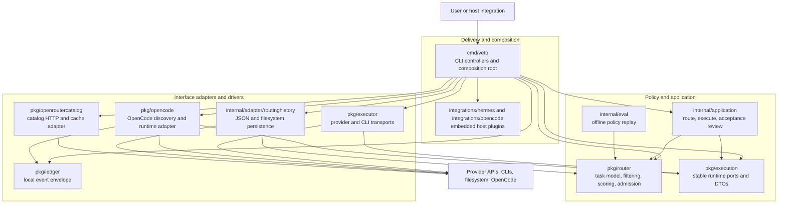

# Clean architecture evaluation

This evaluation applies the dependency rule, boundary design, component
principles, and SOLID to Veto's Go package structure. The initial assessment
of `main` at `bf3f40c` scored 7/10. The implemented boundary changes below
raise the current architecture to 9/10.

## Verdict: 9/10

Veto is a modular monolith with enforced inward dependencies around its core
routing policy. Admission contracts are owned by `pkg/router`, full-execution
contracts are owned by `pkg/execution`, application orchestration lives in
`internal/application`, and filesystem/provider details remain outward
adapters.

The remaining point is not a correctness defect. `cmd/veto` is still a large
component containing several independent command workflows. Those workflows
should move inward only when actual change pressure justifies another boundary;
a folder-only rewrite would add ceremony without improving the product.

## Dependency diagram

Solid arrows are source-code dependencies. The domain and contract packages
have no dependencies on delivery, persistence, provider, or host-integration
packages.

At runtime the CLI builds the registry and concrete adapters. `router.Manager`
filters and ranks models, the router-owned admission port asks candidates, and
`application.Runner` invokes the selected runtime through `pkg/execution`.
Terminal rendering, file output, lifecycle logging, and process exit remain at
the delivery edge.

## Scorecard

| Principle | Score | Evidence |
|---|---:|---|
| Dependency rule | 10/10 | `pkg/router` has no internal-module imports. `pkg/router/import_boundary_test.go` rejects dependencies on executor, command, and integration packages. `pkg/execution` contains contracts only; transports depend on it. |
| Entities and use cases | 9/10 | Routing policy uses plain structs and pure functions. Route-and-execute and fail-closed acceptance review now use plain request/response contracts in `internal/application`. Some independent command policy remains in `cmd/veto`. |
| Adapters and frameworks | 9/10 | Provider HTTP/CLI transports, OpenCode, catalog discovery, routing-history persistence, and host integrations are separate adapters. Compatibility aliases remain in `pkg/executor`, while ownership is in `pkg/execution`. |
| Component principles | 8/10 | The component graph is acyclic and the new packages have single change reasons. `cmd/veto` remains an 8,000+ line component spanning onboarding, diagnostics, updates, integrations, and terminal UX. |
| SOLID | 9/10 | Admission, routing, runtime resolution, storage, process, HTTP, and filesystem seams use consumer-owned interfaces. Concrete provider and persistence choices are injected from the composition root. |
| Boundary anatomy | 9/10 | DTOs cross boundaries, `main` composes adapters, and callbacks carry progress/runtime events outward. Delivery wrappers retain rendering, ledger mapping, output-file policy, and `os.Exit`. |

## Implemented recommendations

### 1. Admission dependency inverted

`pkg/router` now owns `AdmissionResult`, `ToolCapabilities`, `Executor`, and
`ExecutorFactory`. `cmd/veto` adapts a concrete runtime to that admission port.
Known-empty and not-yet-discovered tool states remain distinct.

The router package no longer imports `pkg/executor`; an automated boundary test
prevents that edge from returning.

### 2. Filesystem history moved outward

`Store`, `KindAwareStore`, and `MemoryStore` remain in `pkg/router`.
`internal/adapter/routinghistory.FileStore` owns JSON serialization, file modes,
legacy history loading, and best-effort persistence. The persisted format and
routing signals are unchanged.

This removes the former exported `router.FileStore` and `router.NewFileStore`
symbols. Veto's CLI is migrated, but external Go consumers of those symbols
need to own or replace their persistence adapter.

### 3. Application use cases extracted

`internal/application.Runner` owns route-and-execute orchestration, execution
validation, telemetry mapping, streaming compatibility, text-only prompting,
and runtime event callbacks. Its acceptance-review use case owns the JSON
contract, skip-self routing, and fail-closed consistency checks.

`cmd/veto` retains flag parsing, terminal rendering, ledger event mapping,
explicit output-file writes, and process termination. Route, run, exec, plan
conversion, skill generation, and review paths share the application runner.

### 4. Stable execution contracts separated

`pkg/execution` owns result, usage, options, runtime-event, tool-capability, and
runtime port types. `pkg/executor` contains concrete transports and re-exports
compatibility aliases for existing Go callers. `pkg/opencode` implements the
inward execution contracts directly.

## Remaining path to 10/10

1. Add dependency guards for `internal/application` and `pkg/execution` if the
   package graph gains more contributors or adapters.
2. Track change frequency and merge conflicts in `cmd/veto`. Extract the next
   command workflow only when CLI coupling blocks reuse or makes changes unsafe.
3. Decide whether Veto promises a public Go library API. If it does, provide a
   public routing-history adapter or a versioned migration path before the next
   stable release.

The goal is enforceable inward dependencies, not a fixed number of folders or
layers. Diagnostics, updates, login, and integration installers already have
test seams and should remain where they are until a concrete use case needs
them independently from the CLI.

## Verification criteria

An architectural improvement is complete when:

- `pkg/router` imports only the standard library and inward-owned packages;
- boundary tests fail on a new outward routing dependency;
- routing and application policy tests run without real providers, filesystem,
  processes, or terminal setup;
- route, run, exec, streaming, telemetry, and acceptance-review behavior remain
  covered;
- the full race test, vet, and build commands pass.
